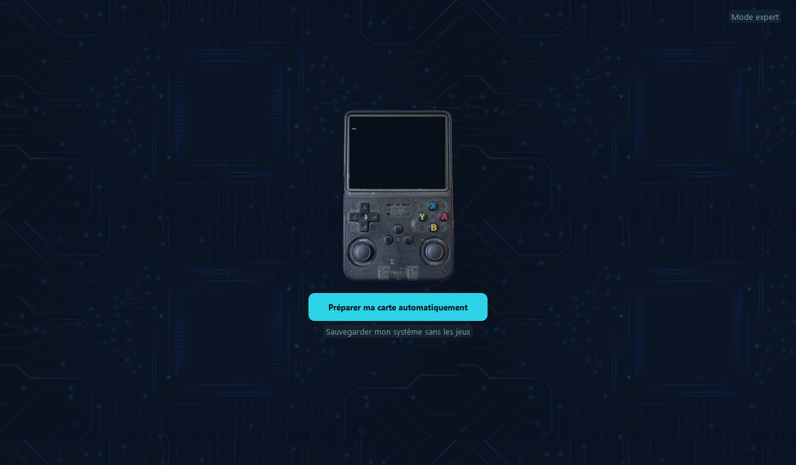
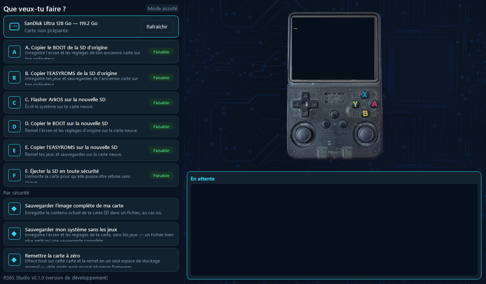

# R36S Studio

Application de bureau gratuite (Windows, macOS, Linux) pour préparer une
carte SD de console R36S — **sans jamais ouvrir de ligne de commande**.

## À qui ça s'adresse

À quelqu'un qui vient de recevoir sa console et qui n'a jamais ouvert de
terminal de sa vie. L'application reconnaît d'elle-même ce qu'il y a sur la
carte SD branchée et propose l'action pertinente — aucun compte à créer,
aucune configuration préalable, aucune connexion internet requise pour les
opérations principales.

## Ce que ça fait

- **Sauvegarder** l'ancienne carte SD dans un fichier, avant de risquer quoi
  que ce soit.
- **Flasher** une carte neuve avec un système (ArkOS, ROCKNIX, EmuELEC...).
- **Réinjecter** l'écran et les réglages de l'ancienne carte sur la neuve.
- **Copier** les jeux et sauvegardes de l'ancienne carte vers la neuve.
- **Remettre une carte à zéro** si des essais de firmware l'ont laissée en
  plusieurs partitions illisibles pour un ordinateur.

Deux façons de s'en servir :

- **Parcours guidé** — cinq étapes, une carte puis l'autre, aucune question
  technique posée. C'est l'écran par défaut.
- **Mode expert** — les six opérations disponibles séparément, pour qui
  préfère garder la main sur chaque étape.

## Captures d'écran

| Parcours guidé (accueil) | Mode expert |
|---|---|
|  |  |

## Garanties de sécurité

- Aucune carte n'est jamais présélectionnée — l'utilisateur choisit toujours
  activement, même quand une seule carte est branchée.
- Le disque système de l'ordinateur, et tout disque non amovible/non USB,
  sont exclus de la liste avant même d'être proposés — un disque refusé
  n'apparaît pas grisé, il n'apparaît pas du tout.
- Toute écriture destructrice (flasher, remettre à zéro) exige une
  confirmation explicite, avec une case à cocher — jamais de sélection par
  défaut ni de double-clic accidentel.
- La barre de progression affichée correspond toujours à une progression
  réelle (octets copiés, étape effectivement terminée) — jamais une
  animation qui avance seule pendant que le vrai travail se termine
  ailleurs.

## Installation

Aucune ligne de commande n'est nécessaire pour *utiliser* l'application —
seulement pour la construire soi-même depuis les sources (voir
[Pour les développeurs](#pour-les-développeurs) plus bas, si tu préfères
cette voie). Pour tout le monde d'autre : télécharge le binaire de ton
système sur la page [Releases](../../releases).

| Système | Archive | Premier lancement |
|---|---|---|
| Windows | `R36S-Studio-windows.zip` | Décompresse l'archive entière (pas seulement l'exe), puis double-clique sur `R36S Studio.exe`. **Windows SmartScreen affichera un avertissement** (« Windows a protégé votre ordinateur ») — c'est normal, le binaire n'est pas signé par un certificat payant. Clique **Informations complémentaires**, puis **Exécuter quand même**. |
| macOS | `R36S-Studio-macos.zip` | Décompresse, puis **clic droit sur l'app → Ouvrir** (jamais un simple double-clic la première fois) — l'app n'est pas notariée par Apple, Gatekeeper la bloquerait sinon. Ensuite, l'app te guidera elle-même vers Réglages Système → Confidentialité et sécurité pour lui accorder l'**Accès complet au disque**, nécessaire pour lire/écrire une carte SD sur macOS. |
| Linux | `R36S-Studio-linux.tar.gz` | Décompresse (`tar xzf R36S-Studio-linux.tar.gz`), puis lance `./R36S\ Studio/R36S\ Studio`. |

Ces avertissements de premier lancement existent uniquement parce
qu'aucun des trois binaires n'est signé avec un certificat payant
(200–400 €/an, une dépense volontairement évitée pour l'instant) — ils
s'atténuent avec le nombre de téléchargements sur Windows, et ne
remettent rien en cause côté fonctionnement de l'application.

## Ce que ce logiciel ne fournit jamais

**Aucune ROM, aucun BIOS, aucune image système `.img` n'est inclus dans ce
dépôt ni dans les binaires distribués.** L'image du système à flasher
(ArkOS, ROCKNIX...) est soit téléchargée par l'application elle-même
directement depuis la source officielle du projet correspondant (avec
vérification de somme de contrôle quand le dépôt en fournit une), soit
choisie par l'utilisateur parmi ses propres fichiers. Ce logiciel prépare
une carte SD ; il ne fournit et ne diffuse aucun contenu protégé par le
droit d'auteur.

---

## Pour les développeurs

Le cahier des charges complet (contraintes de sécurité, architecture
GUI/worker, détail de chaque module) vit dans [`CLAUDE.md`](CLAUDE.md).

### Mise en route

Prérequis : Python 3.11+.

```sh
python3 -m venv .venv
source .venv/bin/activate          # .venv\Scripts\Activate.ps1 sous Windows
pip install -r requirements.txt -r requirements-dev.txt
```

Lancer l'assistant graphique sans rien construire :

```sh
python -m r36s_studio gui
```

L'app est aussi utilisable en ligne de commande (utile pour le
développement et le diagnostic — jamais exposé à l'utilisateur final,
§1/§5 de `CLAUDE.md`) : `list`, `backup`, `flash`, `extract-boot`,
`extract-easyroms`, `inject-boot`, `copy-games`, `identify`, `eject`,
`reset-card`. Détail de chaque sous-commande :

```sh
python -m r36s_studio --help
python -m r36s_studio <sous-commande> --help
```

### Tests

```sh
python -m pytest
```

Aucun sous-processus réel n'est autorisé pendant les tests
(`tests/conftest.py` intercepte `subprocess.run`/`Popen` — voir §8 de
`CLAUDE.md`) : la suite entière tourne sans carte SD ni droits
administrateur, sur les trois OS.

### Construire un binaire localement

Chaque OS a son propre script de construction ([PyInstaller](https://pyinstaller.org/)) sous
`packaging/` :

| OS | Script | Résultat |
|----|--------|----------|
| macOS | `packaging/build_macos.sh` | `dist/R36S Studio.app` |
| Windows | `packaging/build_windows.ps1` | `dist/R36S Studio/R36S Studio.exe` |
| Linux | `packaging/build_linux.sh` | `dist/R36S Studio/R36S Studio` |

Les trois constructions produisent un dossier **onedir**, jamais un
exécutable **onefile** — délibéré, pas un oubli : PySide6 est distribué
sous licence LGPLv3 (voir [Licences](#licences) ci-dessous), qui exige que
la bibliothèque Qt reste un fichier séparé et remplaçable par
l'utilisateur final plutôt que fusionnée dans un binaire opaque. Détail
complet de cette contrainte : [`packaging/README.md`](packaging/README.md).

`packaging/build_macos.sh dist` construit puis produit en plus
`dist/R36S-Studio-macos.zip`, prêt à distribuer : l'app accompagnée de
`packaging/LISEZ-MOI.txt` (marche à suivre pour un utilisateur final —
autoriser l'app malgré Gatekeeper, puis lui accorder l'Accès complet au
disque). C'est cette même commande qu'utilise la CI (ci-dessous) pour
produire l'artefact macOS de chaque Release.

Chaque script crée son propre `.venv/` s'il n'existe pas déjà, installe les
dépendances, puis appelle le `.spec` PyInstaller correspondant
(`packaging/r36s_studio.spec` pour macOS, `..._windows.spec`,
`..._linux.spec`). Détail complet de la construction, OS par OS, et de la
procédure de vérification sur du vrai matériel : voir
[`packaging/README.md`](packaging/README.md).

### Intégration continue et publication d'une Release

`.github/workflows/build.yml` définit quatre jobs GitHub Actions :

- **Windows**, **macOS**, **Linux** (`windows-latest`, `macos-latest`,
  `ubuntu-22.04`) — chacun installe les dépendances, **lance la suite de
  tests complète** (`python -m pytest`), puis construit le binaire de son
  OS avec le script correspondant ci-dessus et l'empaquette
  (`.zip` pour Windows/macOS, `.tar.gz` pour Linux). Ces trois jobs
  tournent sur **chaque push sur `main`** et **chaque pull request** — un
  changement qui casse la construction ou une régression sur un OS
  particulier est visible avant merge, pas seulement en local sur la seule
  machine du contributeur.
- **release** — ne se déclenche **que sur un tag** de la forme `v*` (ex.
  `v0.2.0`) et seulement si les trois constructions précédentes ont
  réussi (`needs:`). Télécharge les trois artefacts et les publie sur une
  [Release GitHub](../../releases) via `softprops/action-gh-release`, avec
  des notes de version générées automatiquement à partir des commits
  depuis le tag précédent.

Publier une nouvelle version :

```sh
git tag v0.2.0
git push origin v0.2.0
```

Le tag déclenche le workflow complet (tests + construction sur les trois
OS), puis, si tout est vert, la Release GitHub correspondante apparaît
automatiquement avec les trois binaires en pièces jointes — rien d'autre à
faire manuellement. Le numéro de version affiché dans l'app elle-même
(pied de page de l'écran d'accueil, `gui/build_info.py`) vient de
`r36s_studio/__init__.py::__version__`, à mettre à jour avant de poser le
tag pour que les deux restent cohérents.

## Licences

Ce projet est distribué sous licence **GNU General Public License version 3
(GPLv3)** — texte intégral dans [`LICENSE`](LICENSE). La dépendance
principale a des implications à connaître avant toute redistribution :

| Dépendance | Rôle | Licence |
|---|---|---|
| [PySide6](https://pypi.org/project/PySide6/) (Qt pour Python) | Interface graphique | [LGPLv3](https://www.gnu.org/licenses/lgpl-3.0.html) (alternative : licence commerciale Qt, payante — ce projet utilise la voie LGPL) |
| [pytest](https://pypi.org/project/pytest/) (dépendance de développement uniquement, jamais distribuée avec l'app) | Suite de tests | [MIT](https://github.com/pytest-dev/pytest/blob/main/LICENSE) |

**Obligation LGPLv3 de PySide6, et comment ce projet la respecte** : la LGPL
exige que l'utilisateur final puisse remplacer la bibliothèque Qt par une
version modifiée ou plus récente de son choix — impossible si elle est
fusionnée dans un exécutable opaque. Les trois constructions PyInstaller
produisent donc volontairement un dossier **onedir**, jamais un
**onefile** (voir [Construire un binaire
localement](#construire-un-binaire-localement) ci-dessus) : les
DLL/dylib/so de Qt restent des fichiers séparés dans `_internal/PySide6/`,
librement remplaçables sans recompiler l'application.

`gui/assets/console.png` est une photographie prise par l'auteur du projet,
qui en détient les droits — couverte par la licence de ce dépôt comme le
reste du code et des ressources.
